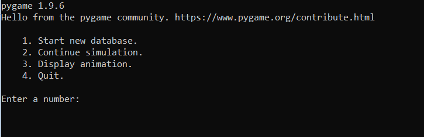
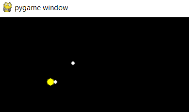

# Project Name
> Simple 2D solar system simulator.

## General info
2D Solar system simulator. It uses Euler method to estimate location and velocity of objects. The purpose of the project was to improve python skills - especially Numpy and SQLite libraries.

## Screenshots
User menu with available options.

Snap from animation.

## Technologies
* numpy
* sqlite3
* pygame

## Modules
* main.py - main module.
* Mass.py - contains Mass class that defines all onjects in Solar System.
* globals.py - contains global values such as gravity constant.
* SQL_db.py - contains code that defines databases.
* display.py - contains code that uses pygame library to display Solar System animation.

## TODO
List of features ready and TODOs for future development
* Add all planets.
* Add GUI.
* Allow user to change globals from  GUI.
* Expand project to third dimension.

## Status
Project is: _in progress_